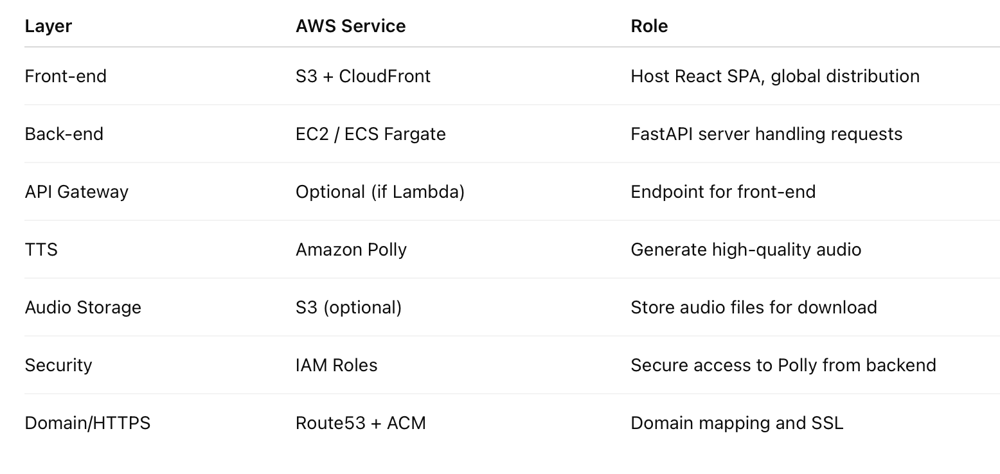
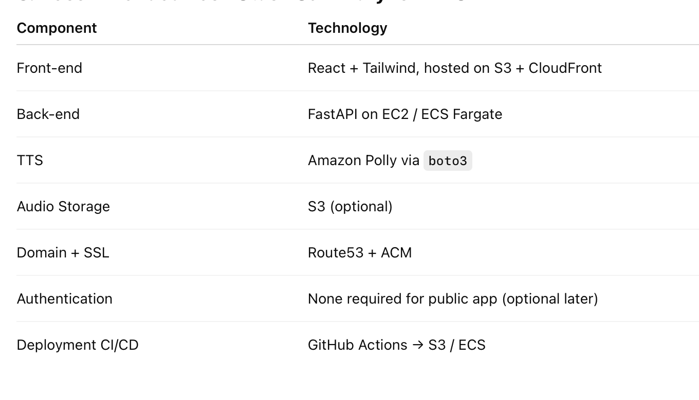

### 1. Overall AWS Architecture

[User Browser] 
      |
      v
[Front-end: React App]  <---> [S3 + CloudFront]
      |
      v
[API: FastAPI]  <---> [AWS Lambda / API Gateway OR EC2 / ECS]
      |
      v
[Amazon Polly]  <---> [Generate MP3/WAV Audio]
      |
      v
[Audio Playback in Browser]

### 2. Front-End Deployment

Option A: S3 + CloudFront (Recommended)
S3: Host React static files (HTML, JS, CSS)
CloudFront: Distribute content globally with HTTPS
Pros:
Cheap and serverless
Scales automatically
HTTPS included via CloudFront
Cons:
Needs configuration for SPA routing (React)
Steps:
Build React app (npm run build)
Upload build/ folder to S3 bucket
Configure CloudFront with S3 origin
Set CORS policies to allow requests to FastAPI backend

### 3. Back-End Deployment Options on AWS

You have two main approaches:
Option A: AWS Lambda + API Gateway (Serverless)
Pros:
No server to manage
Scales automatically
Cost-effective for intermittent usage
Cons:
Lambda has 15 min max execution time
Large TTS requests may need chunking if timeout occurs
Setup:
Package FastAPI with Mangum adapter (FastAPI → Lambda)
Deploy to Lambda
Use API Gateway as HTTPS endpoint
Integrate boto3 to call Amazon Polly

Option B: AWS EC2 / ECS (Server-based / Containerized)
Pros:
No execution time limits
Can handle large requests easily (5000 words)
Full control over environment
Cons:
Must manage instance/container scaling and uptime
Setup:
Launch EC2 instance (Linux)
Install Python, FastAPI, uvicorn
Open port 80/443 or use ALB (Application Load Balancer)
Secure with HTTPS (AWS Certificate Manager + ALB)
Optionally containerize FastAPI and deploy via ECS Fargate for managed scaling

Recommendation: For a simple TTS app, EC2/Fargate is safer because 5000-word text might hit Lambda timeout if Polly audio generation takes too long.

#### 4. Amazon Polly Integration

AWS SDK: Use boto3 in Python
Voice Selection: Fetch describe_voices() from Polly and populate front-end dropdown
Audio Return: Stream back MP3/WAV via FastAPI StreamingResponse
Optional: Store generated audio temporarily in S3 if you want to allow downloads

### 5. Suggested AWS Services for Your Full Deployment

### 6. Deployment Workflow Example

Front-end:
npm run build → Upload to S3
Configure CloudFront for HTTPS

Back-end (FastAPI):
Package app + requirements.txt
Deploy to EC2 / ECS Fargate
Attach IAM role with Polly access

Voice Dropdown:
FastAPI endpoint /voices calls Polly describe_voices()
Front-end fetches voice list and populates dropdown

Text-to-Speech:
POST text + voice → FastAPI → Polly → StreamingResponse
Front-end receives audio and plays it

Optional download:
FastAPI can save audio to S3 for user download

### 7. Security & Cost Notes

Do not expose AWS credentials in front-end
IAM Role Permissions: Only allow Polly SynthesizeSpeech action
Cost:
Amazon Polly: ~$4 per 1 million characters for standard voices, ~$16 per 1M characters for Neural
EC2/Fargate: Pay per running instance
S3/CloudFront: Minimal for small app
Scaling: ECS Fargate can autoscale if traffic grows

### 8. Recommended Tech Stack Summary for AWS

